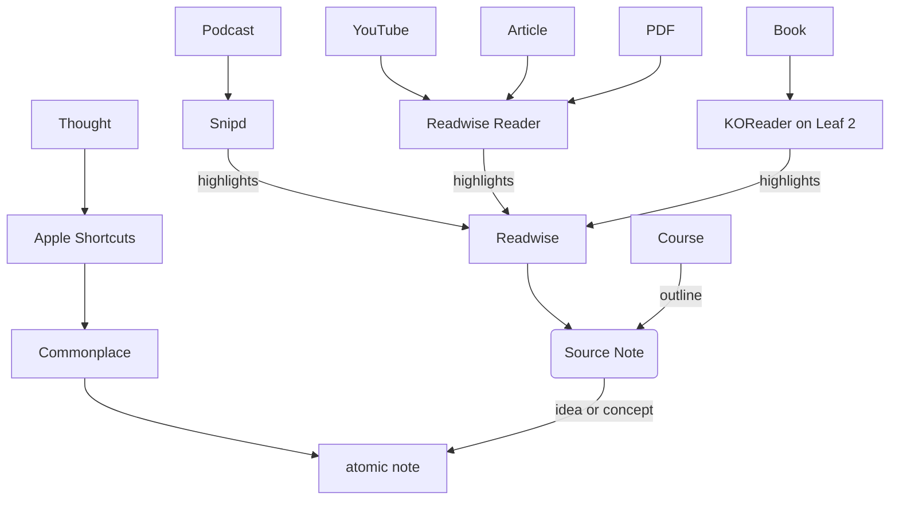
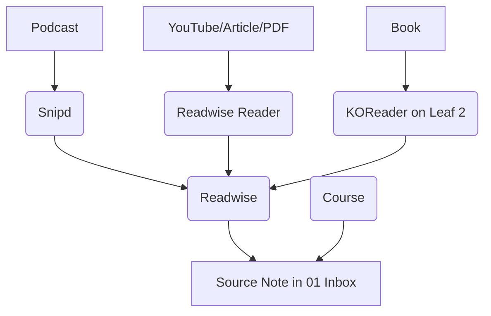
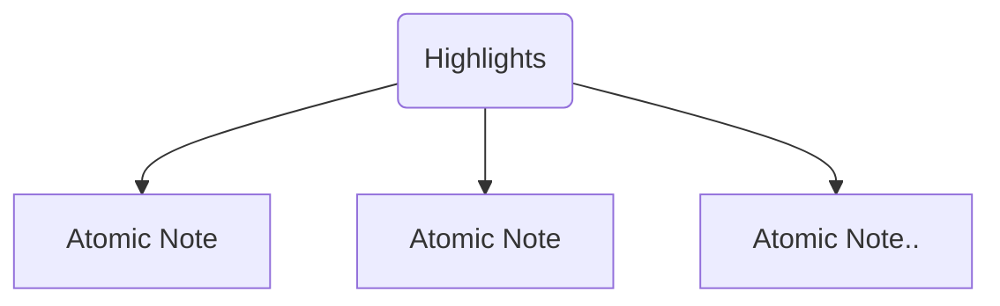
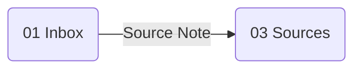
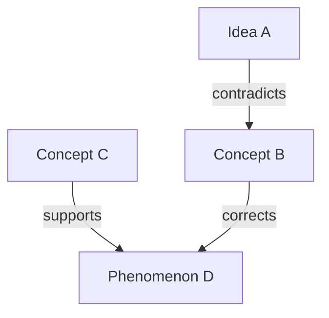

## Highlight what Resonates

test paragraph [[Trying to make this preview happen]]

I consume a lot of different media, like books, articles, and podcasts. See the flowchart above how I get my content in my Obsidian Vault.

I highlight everything that resonates with me (when I feel something or think of something while consuming). I don't filter. After, I gather all these highlights in my source notes in my `01 Inbox` folder. In the processing phase, I'll make more conscious decisions on what I make notes out of. More on that later.

In my source notes, I always include a reference to the original piece of media. It could be a link or any other identifier. See the source note template below.

I use the plugin `Templater` to have more control over the templates. For example adding a 'created' date.

Most of the time, I rely on [Readwise](https://readwise.io) to collect my highlights and place them in my vault under `01 Inbox/Readwise`. I enjoy consuming a thing as a whole, and after that, I scroll through the highlights to *process* them.

> [!info]- Source Note template
>
> \-\-\-
>
> title: <\% tp.file.title \%>
>
> author:
>
> publishdate:
>
> url:
>
> dateRead: <\% tp.date.now \%>
>
> tag:
>
> type:
>
> \-\-\-
>
> \#\# Outline
>
> \#\# Key Takeaways

## Processing and Creating Atomic Notes

In this context, I define *processing* as the act of extracting value from highlights in the form of notes.

In my `01 Inbox` folder, I go through the source notes' highlights. Every idea that still resonates (even after reading it twice) gets written in an 'atomic' note. These notes are often less than 300 words, and I make sure they're focused on one idea alone.

I use a template (`98 Templates/01 New Note`) to create them and tag them as 'new.' They end up in `01 Inbox` by default. (See Writing and Connecting Note on how I write the notes.)

Once I've *processed* a whole source note, I move the source note from the `01 Inbox` to `03 Sources` (`Plugin: Commander - Move File ribbon icon`). Denoting that I've extracted all value from it.

### Writing and Connecting Notes

I force myself to write the atomic notes in my own words. No copy pasting allowed. That usually means simplifying the writing, adding some translations, and avoiding jargon. It really helps you to understand what is being communicated.

Each atomic note has a *reference*, *related*, *new ideas*, and *new questions* section. (See the new note template below.) Under the reference section I refer to the source note in my vault.

While writing a note, if I think of notes that **contradict, correct, or support** the idea, I make sure to link it. Either inline or under the _related_ section. It helps when you write a short description on how it is related.

I jot down any new ideas (💡) or questions (🧐) that arise while writing the note. New ideas get written in another atomic note and linked (`Plugin: Note Refactor`).

Because I tag questions with `#question`, I can use `Plugin: Dataview` to list them all in one note.

> [!info]- List all \#questions Dataview Query
>
> \`\`\`dataview
>
> LIST
>
> L.text
>
> FROM "02 Notes"
>
> flatten file.lists as L
>
> where contains(L.tags, "#question")
>
> \`\`\`

> [!info]- New note template
>
> \-\-\-
>
> date: <\% tp.file.creation_date("YYYY-MM-DD HH:mm") \%>
>
> title: <\% tp.file.title \%>
>
> tags: new
>
> \-\-\-
>
> <\% tp.file.cursor(1) \%>
>
> ---
>
> **↩️ Reference**:
>
> **🖇️ Related (and how?)**: %% contradicts, corrects, supports %%
>
> **💡New ideas**:
>
> **🧐 New questions**:

## Reviewing and Resurfacing Notes

Every day, I try to resurface at least one note using the `plugin: Simple Note Review`.

As I review the note, I ask myself how the information adds to my other notes. I ask the same questions as I did when creating the note. Does it contradict, correct, or support other notes? Do new ideas come to mind? Do any new questions arise?

> [!info] The Collector's Fallacy
>
> Remember, you're not just collecting information; you're developing your ideas and arguments. Notes shouldn't go 'stale'. It's that, that separates traditional note taking from personal knowledge management.

At this point, I consider the note no longer `new` and remove the tag, if it had it. Although I rather review 'new' notes, I also make sure I bring older notes in the mix.

Resurfacing notes at random really helps 'tend' to your personal knowledge management. There is something satisfying about being aware your perspective changed since you last wrote said note. Or that new information fills a gap in your knowledge you didn't know you had.

> [!info] Maps of Content
>
> If I find myself pulling in too many related notes on to one atomic note, I consider creating a Map of Content instead, organizing the related notes under specific topics and headings. You can also see these MoCs develop organically in your graph view.
